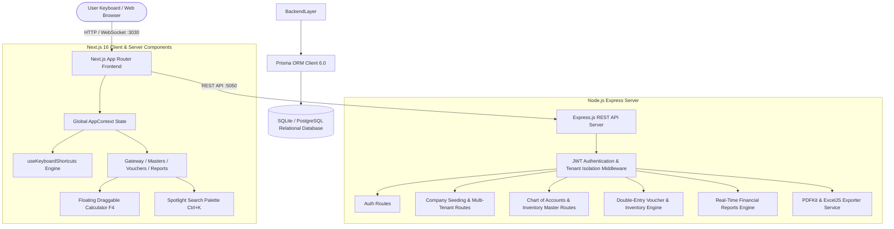
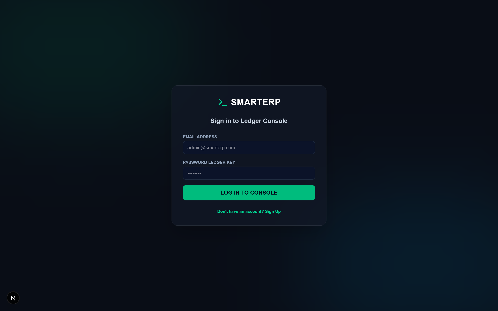
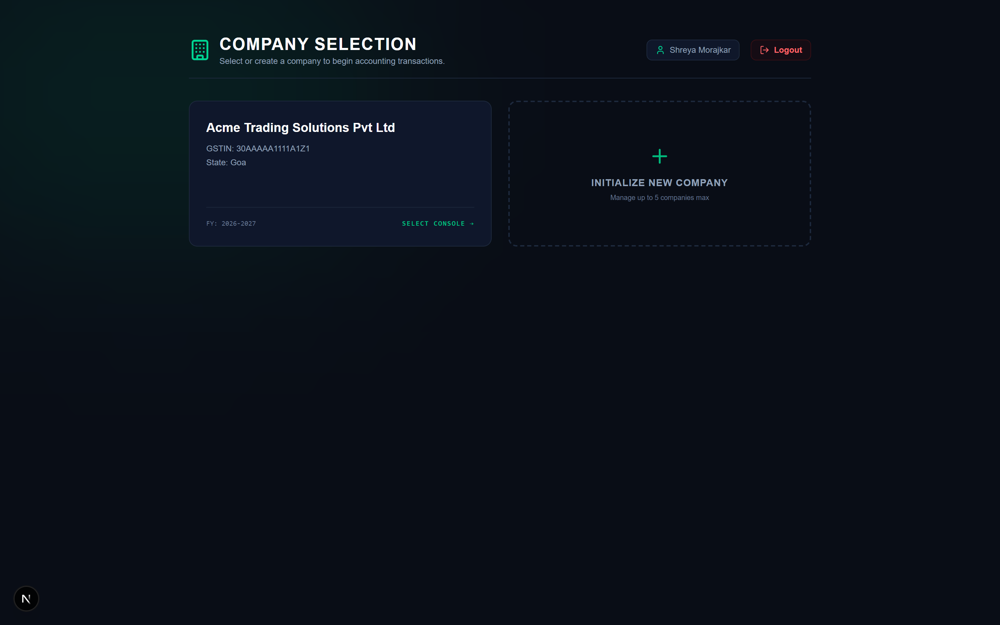
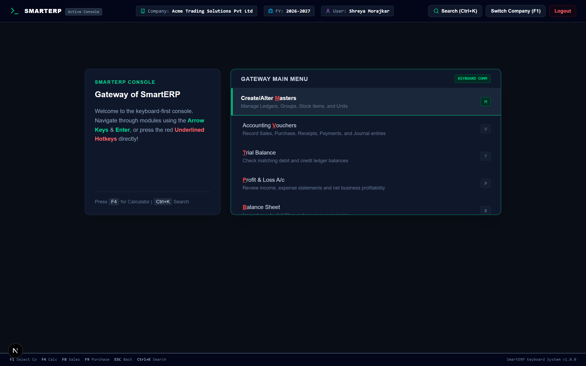
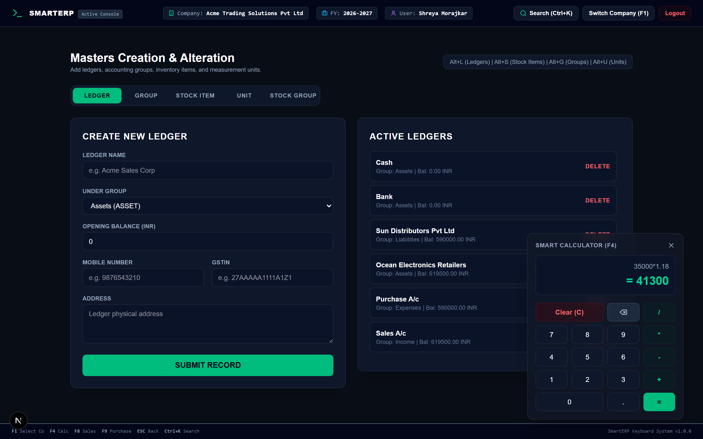
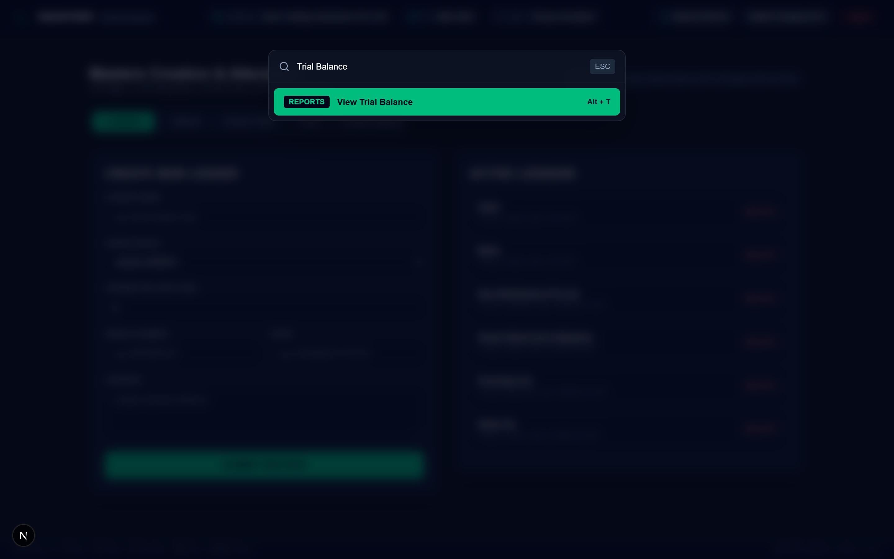
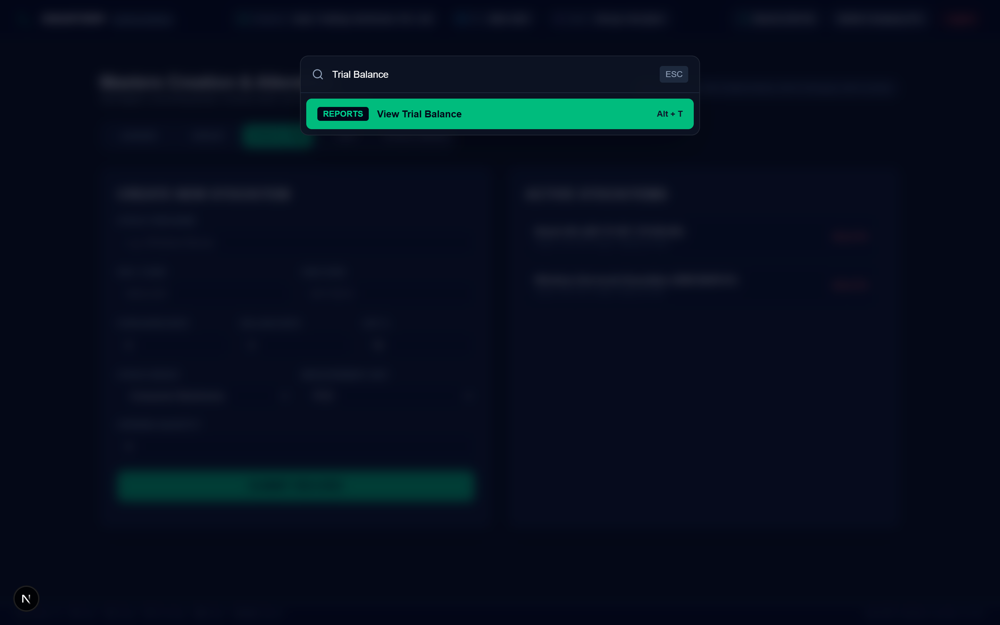
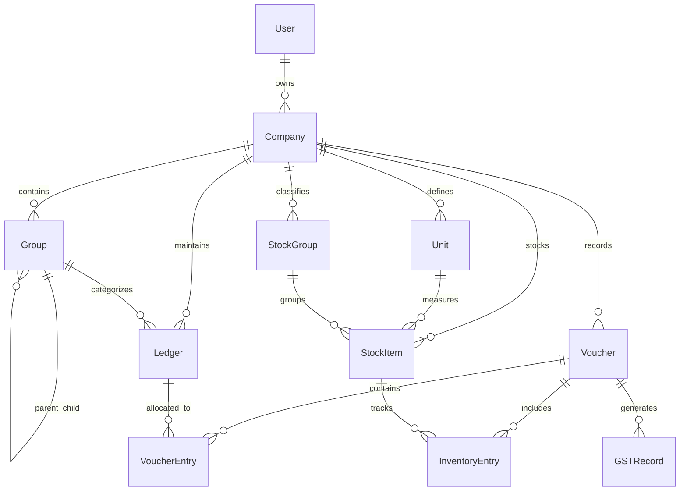

# ⚡ SmartERP — Billing, Inventory & Accounting Management System

[](https://nextjs.org/)
[](https://reactjs.org/)
[](https://nodejs.org/)
[](https://expressjs.com/)
[](https://www.prisma.io/)
[](https://tailwindcss.com/)
[](https://www.typescriptlang.org/)
[](#)

> **A high-speed, keyboard-driven cloud accounting platform inspired by Tally ERP.** Built for accountants, business owners, and tax professionals who require high-throughput data entry, real-time double-entry reconciliation, multi-company consolidation, automated Indian GST computation, and instantaneous financial reporting.

---

## 📑 Table of Contents

- [Overview](#-overview)
- [System Architecture](#-system-architecture)
- [Key Features](#-key-features)
- [Live Real-Time Application Screenshots](#-live-real-time-application-screenshots)
  - [1. Authentication & Company Console](#1-authentication--company-console)
  - [2. Gateway of SmartERP & Navigation](#2-gateway-of-smarterp--navigation)
  - [3. Keyboard Productivity Overlays](#3-keyboard-productivity-overlays)
  - [4. Master Records Management](#4-master-records-management)
  - [5. Double-Entry Voucher Transactions](#5-double-entry-voucher-transactions)
  - [6. Real-Time Financial Statements & Reports](#6-real-time-financial-statements--reports)
- [Comprehensive Keyboard Shortcuts Map](#-comprehensive-keyboard-shortcuts-map)
- [Database Schema (ERD)](#-database-schema-erd)
- [Getting Started & Installation](#-getting-started--installation)
  - [Prerequisites](#prerequisites)
  - [Backend Setup](#backend-setup)
  - [Frontend Setup](#frontend-setup)
  - [Running Automated Verification Suite](#running-automated-verification-suite)
- [API Reference](#-api-reference)
- [Tech Stack Summary](#-tech-stack-summary)
- [Author & Credits](#-author--credits)

---

## 🌟 Overview

Traditional ERPs slow accountants down with deeply nested menus and mandatory mouse clicks. **SmartERP** brings the signature keyboard-first speed and muscle-memory efficiency of **Tally** to the modern web, combining:

* **Underlined Hotkey Navigation**: Jump between ledger masters, voucher grids, and financial reports by typing single letters or standard function keys (`F1`-`F9`).
* **Atomic Double-Entry Transactions**: Every voucher automatically debits and credits corresponding ledger accounts within isolated database transactions, maintaining strict mathematical balance.
* **Integrated Inventory Inward/Outward Tracking**: Real-time stock valuation with automatic quantity updates linked directly to purchase and sales vouchers.
* **State-Aware GST Engine**: Automatic CGST + SGST (intra-state) or IGST (inter-state) tax allocation based on company and counterparty state jurisdictions.
* **Export Engine**: Instant server-side generation of professional PDF Tax Invoices and structured Excel (`.xlsx`) ledger spreadsheets.

---

## 🏗️ System Architecture



---

## 🚀 Key Features

| Category | Capability | Description |
| :--- | :--- | :--- |
| **Keyboard First** | Underlined Hotkeys & Function Keys | Complete system control via `F1`-`F9`, `Alt` combos, `ESC` back-stack, and `Ctrl+K` spotlight search. |
| **Multi-Company** | Workspace Isolation | Manage up to 5 distinct businesses per user account with separate financial years and chart of accounts. |
| **Automated Seeding** | Instant Master Initialization | Automatically seeds primary groups (*Assets, Liabilities, Income, Expenses*) and system ledgers (*Cash, Bank*) upon company creation. |
| **Double-Entry** | Multi-Voucher Types | Full support for **Sales (F8)**, **Purchase (F9)**, **Receipt (F6)**, **Payment (F5)**, **Contra (F4)**, and **Journal (F7)** vouchers. |
| **Inventory** | Real-Time Stock Tracking | Track multi-level stock groups, measurement units, HSN codes, cost valuation, and quantity balances across transactions. |
| **GST Engine** | Automated Tax Calculation | Real-time calculation of CGST, SGST, and IGST with automated tax ledger entries and GSTR-1/GSTR-3B summaries. |
| **Financial Reports** | Dynamic Statement Engine | Instant real-time computation of **Trial Balance**, **Profit & Loss**, **Balance Sheet**, and **Stock Summary**. |
| **Document Generation** | PDF & Excel Exports | One-click download of compliant GST tax invoices (PDF) and formatted financial reports (`.xlsx`). |

---

## 📸 Live Real-Time Application Screenshots

All screenshots below are captured in real-time from the running SmartERP deployment.

---

### 1. Authentication & Company Console

The application welcomes users with a sleek dark-mode glassmorphic authentication console, followed by a multi-company selector displaying active workspaces and financial years.

| Sign In & Auth Console | Multi-Company Workspace Selector |
| :---: | :---: |
|  |  |

---

### 2. Gateway of SmartERP & Navigation

The primary operations hub inspired by the Tally Gateway. Every command features a red highlighted hotkey for lightning-fast keyboard navigation.



---

### 3. Keyboard Productivity Overlays

* **Floating Calculator (`F4`)**: Perform instant margin, markup, and tax calculations anywhere in the application without losing your active voucher context.
* **Spotlight Command Palette (`Ctrl + K`)**: Instant search and navigation across all ledgers, voucher types, stock items, and financial reports.

| Smart Calculator Overlay (`F4`) | Spotlight Command Search (`Ctrl + K`) |
| :---: | :---: |
|  |  |

---

### 4. Master Records Management

Unified management for your Chart of Accounts (Ledgers & Groups) and Multi-Level Inventory (Stock Items, Units of Measure, and Stock Groups).

| Chart of Accounts (Ledgers & Groups) | Multi-Level Inventory Masters |
| :---: | :---: |
|  |  |

---

### 5. Double-Entry Voucher Transactions

High-speed voucher grids that automatically balance debit/credit entries, calculate Indian GST tax allocations, and adjust stock quantities in a single atomic database transaction.

| Sales Invoice Voucher (`F8`) | Purchase Inward Voucher (`F9`) |
| :---: | :---: |
|  |  |

---

### 6. Real-Time Financial Statements & Reports

Instantaneous computation of financial statements derived from double-entry ledger transactions:

| Live Trial Balance (`Alt + T`) | Profit & Loss Statement (`Alt + P`) |
| :---: | :---: |
|  |  |

| Balance Sheet (`Alt + B`) | Stock Valuation Summary (`Alt + R`) |
| :---: | :---: |
|  |  |

| GST Tax Register & Summary (`Alt + X`) |
| :---: |
|  |

---

## ⌨️ Comprehensive Keyboard Shortcuts Map

| Shortcut | Function / Scope | Description |
| :--- | :--- | :--- |
| **`F1`** | Global | Open Company Selection Screen / Switch Company |
| **`F4`** | Global | Toggle Draggable Floating Calculator Overlay |
| **`F5`** | Global / Masters | Refresh Master Ledgers & Stock Data Cache |
| **`F6`** | Voucher Grid | Switch to **Receipt Voucher** (Cash/Bank Inflow) |
| **`F7`** | Voucher Grid | Switch to **Journal Voucher** (Adjustment Entries) |
| **`F8`** | Voucher Grid | Switch to **Sales Voucher** (Outward Stock & Tax Invoice) |
| **`F9`** | Voucher Grid | Switch to **Purchase Voucher** (Inward Stock & Supplier Credit) |
| **`Ctrl + K`** | Global | Open Spotlight Command Palette Search |
| **`Ctrl + H`** | Global | Return to Home / Gateway of SmartERP |
| **`Ctrl + Q`** | Global | Secure Sign Out / Clear Session Tokens |
| **`ESC`** | Global | Navigate Back / Close Active Modal / Return to Gateway |
| **`Alt + L`** | Masters | Switch to Ledgers Master Tab |
| **`Alt + S`** | Masters | Switch to Stock Items Master Tab |
| **`Alt + G`** | Masters | Switch to Account Groups Tab |
| **`Alt + U`** | Masters | Switch to Measurement Units Tab |
| **`Alt + T`** / **`T`** | Reports / Gateway | Open Real-Time **Trial Balance** Statement |
| **`Alt + P`** / **`P`** | Reports / Gateway | Open Real-Time **Profit & Loss** Account |
| **`Alt + B`** / **`B`** | Reports / Gateway | Open Real-Time **Balance Sheet** Statement |
| **`Alt + R`** | Reports | Open Real-Time **Stock Summary** Valuation |
| **`Alt + X`** | Reports | Open Real-Time **GST Tax Register** |

---

## 🗄️ Database Schema (ERD)



---

## 🛠️ Getting Started & Installation

### Prerequisites

* **Node.js**: v18.0.0 or higher
* **npm**: v9.0.0 or higher
* **Git** installed and configured

---

### Backend Setup

1. Open a terminal and navigate to the backend directory:
   ```bash
   cd backend
   ```

2. Install dependencies:
   ```bash
   npm install
   ```

3. Configure environment variables in `backend/.env`:
   ```env
   PORT=5050
   DATABASE_URL="file:./dev.db"
   JWT_SECRET="smarterp_super_secret_jwt_key_2026!"
   ```

4. Run Prisma database migrations and generate client:
   ```bash
   npx prisma migrate dev --name init
   npx prisma generate
   ```

5. Start the backend REST API:
   ```bash
   node server.js
   ```
   *The server will boot on **http://localhost:5050***.

---

### Frontend Setup

1. Open a second terminal and navigate to the frontend directory:
   ```bash
   cd frontend
   ```

2. Install frontend dependencies:
   ```bash
   npm install
   ```

3. Start the Next.js development server:
   ```bash
   npm run dev
   ```
   *The Next.js console will be available at **http://localhost:3030***.

---

### Running Automated Verification Suite

SmartERP includes a comprehensive end-to-end integration test harness that exercises user authentication, multi-tenant company creation, master data seeding, double-entry voucher posting, inventory valuation adjustments, and balance sheet mathematical reconciliation:

```bash
cd backend
node test_features.js
```

**Expected Test Output:**
```
=== starting smarterp functionality integration tests ===

1. Testing User Authentication...
   ✓ Admin User registered: testuser_1788797770794@smarterp.com
   ✓ Logged in successfully, token retrieved.

2. Testing Company Management...
   ✓ Company initialized: Acme Accounting Ltd (ID: 1bdc7b8b-893a-41b6-ab39-484f62861f65)

3. Testing Masters Setup & Seeding...
   ✓ Seeded groups found: Assets, Liabilities, Income, Expenses
   ✓ Seeded ledgers found: Cash, Bank
   Creating Custom Ledgers...
     ✓ Created Supplier Ledger: Sun Distributors
     ✓ Created Customer Ledger: Ocean Retailers
     ✓ Created Purchase Ledger: Purchase A/c
     ✓ Created Sales Ledger: Sales A/c
     ✓ Created Unit: PCS
     ✓ Created Stock Group: Electronics
     ✓ Created Stock Item: Smart LED TV (Opening Qty: 100)

4. Testing Purchase Voucher (Inventory Inward)...
   ✓ Recorded Purchase Voucher: PUR-1788797771456
   ✓ Supplier Balance: 236000 INR (Expected: 236000)
   ✓ Stock Quantity: 120 PCS (Expected: 120)

5. Testing Sales Voucher (Inventory Outward)...
   ✓ Recorded Sales Voucher: SAL-1788797771504
   ✓ Customer Balance: 177000 INR (Expected: 177000)
   ✓ Stock Quantity: 110 PCS (Expected: 110)

6. Testing Accounting Reports...
   ✓ Trial Balance: Debit Sum = 413000 INR | Credit Sum = 413000 INR
   ✓ Profit & Loss: Revenue = 177000 INR | Expense = 236000 INR | Net Profit = -59000 INR
   ✓ Balance Sheet: Total Assets = 177000 INR | Total Liabilities = 177000 INR
   ✓ Stock Summary: Total Valuation = 1100000 INR (Expected: 1,100,000 INR)
   ✓ GSTR Summary: CGST = 31500 INR | SGST = 31500 INR | IGST = 0 INR

🎉 ALL SMART-ERP FUNCTIONAL INTEGRATION TESTS PASSED SUCCESSFULLY! 🎉
```

---

## 🔌 API Reference

| Method | Endpoint | Description | Auth Required |
| :--- | :--- | :--- | :---: |
| `POST` | `/api/auth/register` | Register a new administrator account | No |
| `POST` | `/api/auth/login` | Authenticate user & return JWT token | No |
| `GET` | `/api/auth/me` | Fetch authenticated user profile | Yes |
| `GET` | `/api/companies` | List all companies under user workspace | Yes |
| `POST` | `/api/companies` | Create new company & seed groups/ledgers | Yes |
| `GET` | `/api/masters/groups` | Fetch Chart of Account groups | Yes |
| `POST` | `/api/masters/groups` | Create custom sub-group | Yes |
| `GET` | `/api/masters/ledgers` | Fetch all active ledger accounts | Yes |
| `POST` | `/api/masters/ledgers` | Create new party/nominal ledger | Yes |
| `GET` | `/api/masters/stock-items` | Fetch all stock items & current quantities | Yes |
| `POST` | `/api/masters/stock-items` | Create new inventory item with HSN/GST | Yes |
| `GET` | `/api/vouchers` | List recorded vouchers for active company | Yes |
| `POST` | `/api/vouchers` | Record double-entry voucher & update stock | Yes |
| `GET` | `/api/reports/trial-balance` | Fetch real-time Trial Balance statement | Yes |
| `GET` | `/api/reports/profit-loss` | Fetch real-time Profit & Loss account | Yes |
| `GET` | `/api/reports/balance-sheet` | Fetch real-time Balance Sheet statement | Yes |
| `GET` | `/api/reports/stock-summary` | Fetch real-time Stock valuation summary | Yes |
| `GET` | `/api/reports/gst-summary` | Fetch GST register & tax breakdown | Yes |
| `GET` | `/api/export/invoice/:voucherId` | Generate & download PDF Tax Invoice | Yes |
| `GET` | `/api/export/excel/:reportType` | Generate & download Excel spreadsheet | Yes |

---

## 💻 Tech Stack Summary

* **Frontend Framework**: Next.js 16 (App Router, React 19)
* **Styling & UI**: Tailwind CSS v4, Lucide Icons, Radix UI Primitives
* **State Management**: React Context API (`AppContext`), Custom Keyboard Event Hooks
* **Backend API**: Node.js, Express.js 4
* **ORM & Database**: Prisma ORM 6, SQLite / PostgreSQL
* **Security & Auth**: JSON Web Tokens (JWT), bcrypt.js Password Hashing
* **Document Services**: PDFKit (Vector PDF Invoices), ExcelJS (Spreadsheet Workbooks)
* **Automation & Testing**: Puppeteer-core, Node.js Native Integration Runner

---

## 👩‍💻 Author & Credits

* **Developer**: [Shreya Morajkar](https://github.com/ShreyaMorajkar)
* **Repository**: [https://github.com/ShreyaMorajkar/SmartERP](https://github.com/ShreyaMorajkar/SmartERP)
* **Project**: SmartERP — Billing, Inventory & Accounting Management System

---

<p align="center">
  <b>SmartERP Keyboard System &bull; Fast &bull; Cloud-Native &bull; Accurate</b>
</p>
